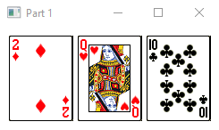
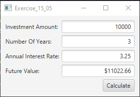
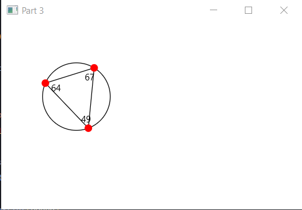
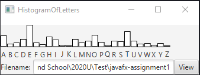

# JavaFX First Assignment
This is the first assignment for Software Systems Development and Integration using JavaFX as the main development language.
## Description of Assignment Components
### Part 1
A frame that contains three labels. Each label displays a card, as shown in the figure below. The card image files are named `1.png, 2.png, ..., 54.png` and stored in the `Cards` directory. All three cards are distinct and selected randomly.

### Part 2
A program that calculates the future value of an investment at a given interest rate for a specified number of years.

### Part 3
A circle with three random points on the circle which form a triangle. The program will display the angles in the triangle. Use the mouse to drag a point along the perimeter of the circle. As you drag it, the triangle and angles are redisplayed dynamically.

### Part 4
A program that displays a histogram to show the occurrences of each letter in a text area. The histogram should show the occurrences of each letter in a text file, as shown in the following figure. Assume that the letters are not case sensitive.

## Getting Started
### How to Install
Clone the repository to your local machine using Github's built-in features or on the command-line using `git clone <repository-URL>`.
### How to Run
- Using IntelliJ as your IDE, import the project.
- Once the project is open, go to **File > Project Structure > Libraries > +** and navigate to the `jfxrt.jar` file located within the project to add it to the project.
- Open the project configuration menu located at the top right of the IDE and select **Edit Configuration**.
- Add `--module-path ${PATH_TO_FX} --add-modules javafx.controls,javafx.fxml` to the **VM Options**.
- Press **Run** to see the results of each program. 

_Make sure to do each step for each individual program!_